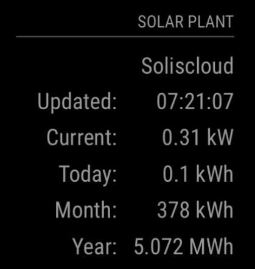
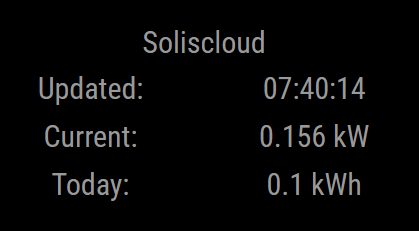

# MMM-Soliscloud

[MagicMirror²](https://github.com/MagicMirrorOrg/MagicMirror) module for displaying [Soliscloud](https://solis-service.solisinverters.com/en/support/solutions/articles/44002212561-api-access-soliscloud) inverter data.

This module pulls data from the Soliscloud API and displays it as a simple table on the Magic Mirror.

## Screenshots




## Installation

* Install [MagicMirror²](https://docs.magicmirror.builders/)
* `cd <MagicMirrorInstallation>/modules`
* `git clone https://github.com/dekinet/MMM-Soliscloud.git`
* `cd MMM-Soliscloud`
* `npm install`

## Configuration
There are a number of configuration options available:

| Option               | Default          | Description  |
| ----------------------|-----------------| -------------|
| `intervalSecs`        | 300             | Defines how often to poll the API for data. Don't do this too quickly, or your requests will be rejected by the server. |
| `lastUpdated`         | true            | Display the timestamp of the last time data was sent to the server by the inverter. |
| `currentPower`        | true            | Display the current power generated. |
| `dayTotalGenerated`   | true            | Display the amount of power generated today. |
| `monthTotalGenerated` | false           | Display the amount of power generated this month. |
| `yearTotalGenerated`  | false           | Display the amount of power generated this year. |
| `totalGenerated`      | false           | Display the total amount of power generated. |
| `price`               | false           | Display the current price. |
| `dailyIncome`         | false           | Display the daily income value. |
| `allIncome`           | false           | Display the total income value. |
| `displayAlarms`       | true            | Display the most recent alarm (if active). |
| `alarmTimeFormat`     | "lll"           | [Moment display string](https://momentjs.com/docs/#/displaying) used for formatting the start time of the most recent alarm. |
| `gpioOnAlarm`         | 0               | Set the Raspberry Pi GPIO number to drive when an alarm is active. Setting to 0 disables this feature. Tested on a Raspberry Pi 3 B+, |
| `gpioOnAlarmState`    | "high"          | If driving a GPIO pin is enabled, the pin will be driven to this state when an alarm is active. Valid values are "high" and "low". |

In addition, the MM config file must include you Soliscloud API key and secret. There are no default values for these.

An entry in the module configuration file might look like this:
```
  {
    module: "MMM-Soliscloud",
    position: "top_right",
    config: {
      intervalSecs: 600,
      yearTotalGenerated: true,
      allIncome: true,
      apiKey: "123456",
      apiSecret: "abcdefg",
  },
```

## Dependencies

* [MagicMirror²](https://github.com/MagicMirrorOrg/MagicMirror)
* [base-64](https://www.npmjs.com/package/base-64): Used to base-64 encode requests/data sent to the API
* [crypto](https://www.npmjs.com/package/crypto): Used to create a digest of data sent to the API
* [onoff](https://www.npmjs.com/package/onoff): Used to activate GPIO when alarms active

## Styling
A simple `styles.css` file is included. The generated data utilises the following classes:

| Class Name                | Used |
| --------------------------|------|
| `soliscloud-data`         | The whole generated div |
| `soliscloud-table`        | The table containing Soliscloud data |
| `soliscloud-row`          | All rows in the table |
| `soliscloud-cell`         | All cells in the table |
| `soliscloud-alarm`        | Applied to the entire ALARM row (if active). Flashing red by default. |

## Limitations
I only had access to one inverter, so received data from multiple interverters is not  handled. Fixes are welcome.
Alarm handling is very basic and not well tested. Only the most recent active alarm will be displayed (if alarms are configured to be displayed).
